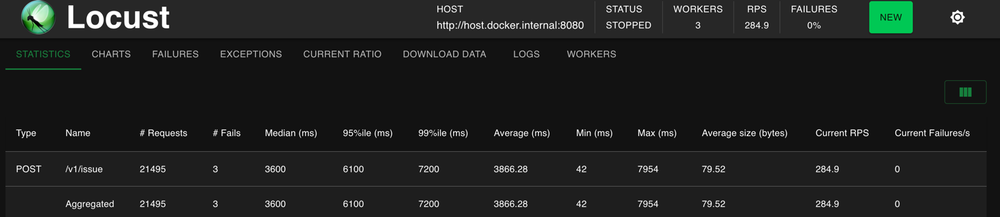
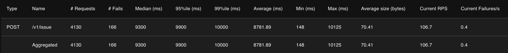
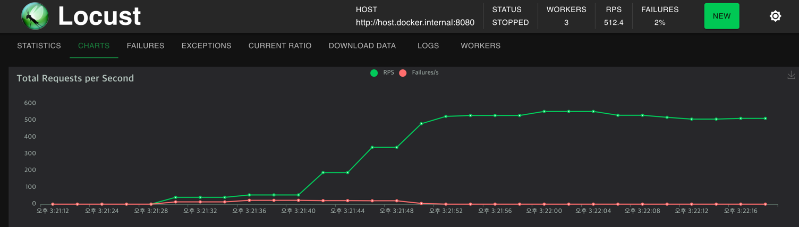
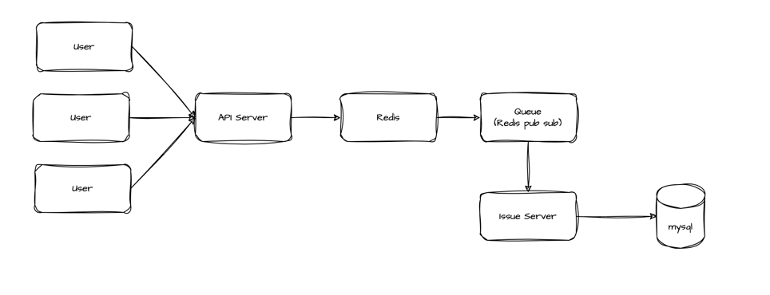

# coupon
이벤트 선착순 쿠폰 발급 시스템 개발을 위한 레포

## Setting
```shell
# mysql, redis 세팅
$ cd coupon-negoking
$ docker-compose up -d

# 부하테스트 locust 세팅
# worker가 1개인 경우 부하를 생성하면서 부하를 가하다보니 API 서버에서는 부하를 더 받을 수 있는데 cpu를 거의 다 사용하여 제대로 된 테스트가 안될 수 있음
$ cd loadtest
$ docker-compose up -d --scale worker=3
```

## Trouble Shooting
현재 이슈는 쿠폰이 500개만 발급이 되어야하지만 실제로 500개를 초과하는 동시성 이슈가 발생. 

동시성을 어떻게 해결할 수 있을까?

### 1. synchronized
```java
public void issueV1(CouponIssueRequestDto requestDto) {
    synchronized (this) {
        couponIssueService.issue(requestDto.couponId(), requestDto.userId());
    }
}
```

- before
  - 1000명의 유저로 부하테스트시 평균 RPS 1500
- synchronized after
  - 1000명의 유저로 부하테스트시 평균 RPS 200~300
  
    


- 안정성은 확보했지만 해당 키워드는 어플리케이션에 종속적이기 때문에 여러 서버로 확장되면 lock을 관리할 수 없다.
- 분산락을 구현해보자.

<br>

### 2. 분산락
현재 스택에서 구현할 수 있는 분산락은 다음과 같다.
1. redis
2. mysql record lock


### 2.1 레디스 분산 락
```java
public void issueV1(CouponIssueRequestDto requestDto) {
    final String lockName = LOCK_PREFIX + requestDto.couponId();
    lockExecutor.execute(lockName, 10_000, 10_000,
        () -> couponIssueService.issue(requestDto.couponId(), requestDto.userId())
    );
}
```


데이터 수와 요청수가 많지 않아 synchronized 부하 테스트와 RPS는 큰 차이가 없다.

### 2.2 Mysql Record Lock
```java
public interface CouponJpaRepository extends JpaRepository<Coupon, Long> {
    @Lock(LockModeType.PESSIMISTIC_WRITE)
    @Query("SELECT c FROM Coupon c WHERE c.id = :id")
    Optional<Coupon> findByIdWithLock(long id);
}

```

조회 쿼리에서 `for update` 키워드 사용
> SELECT * FROM coupon WHERE id = 1 FOR UPDATE;

쿠폰 id가 1인 record에 X Lock이 걸림, X LOCK은 중첩해서 걸 수 없다.




데이터와 요청수가 적다면 X Lock이 성능이 더 좋을 수 있지만 데이터 수가 많고 요청수가 많아질수록 redis 의 성능이 우수할 것으로 예상


<br>
<br>
<br>

## Redis 기반 쿠폰 발급 서버 구조
- N명의 유저 트래픽에 대해 스케일 아웃해서 트래픽을 처리할 순 있지만 **요청을 받는 것과 잘 처리하는 것은 별개**
- 여러 API 서버에 대한 디비 병목을 고려하여 트래픽을 감당하는 부분과 Redis를 통해 쿠폰 발급 트랜잭션을 분리
  - Redis를 통한 트래픽 대응
  - MySQL 트래픽 제어
  - Queue를 통해 발급 요청 / 발급 과정을 분리



1. N명의 유저가 요청을 보낸다.
2. API 서버에서는 요청을 처리한다.
3. Redis에서 요청을 처리하고 쿠폰 발급 대상을 큐에 저장한다.
4. 쿠폰 발급 서버에서 큐를 조회하여 쿠폰 발급 대상을 발급 처리한다.

<br>

### 기능 분석 및 Caching

검증
- 쿠폰 존재 검증
- 쿠폰 발급 유효 기간 검증
- 쿠폰 발급 수량 검증
- 중복 발급 검증

발급

- 쿠폰 발급 수량 증가
- 쿠폰 선착순 처리
- 쿠폰 발급 내역 기록

Caching
- [x] 쿠폰 존재 검증
  - Coupon 엔티티 캐시
- [x] 쿠폰 발급 유효 기간 검증
  - 캐시된 Coupon 엔티티의 유효기간 비교
- [x] 쿠폰 발급 수량 검증
  - Set 자료구조를 이용하여 중복을 허용하지 않도록 처리 (ZCARD)
- [x] 중복 발급 검증
  - Set 자료구조를 이용하여 요청 중복 처리 제거 (ZRANK)
- [x] 선착순 처리
  - score를 timestamp로 활용하면 요청 순서로 정렬할 수 있다.

발급 수량 증가는 실시간으로 변경이 되는 값 + 비동기로 발급되다보니 레디스에서 증가하기에 한계가 있음

시간 복잡도도 O(logN) 이므로 Sorted Set or Set을 사용하는게 좋을것 같다.

둘중 어떤 자료구조가 더 적합할까?

<br>

### Sorted Set 시나리오

1. 유저 요청이 들어온다. (coupon_id, user_id)
2. 쿠폰 캐시를 통한 유효성 검증
    - 쿠폰의 존재
    - 쿠폰의 유효기간
3. Sorted Set에 요청을 추가 (ZADD score = time stamp)
    - ZADD의 응답 값 기반 발급 검증
4. 현재 요청의 순서 조회 (ZRANK) 및 발급 성공 여부 응답
5. 쿠폰 발급 Queue에 적재

### Sorted Set을 사용하면서 발생하는 문제점
아래와 같이 Sorted Set에 score(time stamp)가 동일한 데이터가 존재할 때, 누가 먼저 왔는지 보장할 수가 없다.

| id      | score         |
|---------|---------------|
| 1680003 | 1718168361002 |
| 255804  | 1718168361002 |
| 3294964 | 1718168361002 |
| 4753510 | 1718168361002 |

그러면 어떻게 할 수 있을까?

Redis를 이용하여 채번 로직을 추가해볼 순 있지만 관리 포인트가 더 늘어난다.

Set으로 바꾼다면 좀 더 간단하게 해결할 수 있다.

<br>

### Set 시나리오
1. 유저 요청이 들어온다. (coupon_id, user_id)
2. 쿠폰 캐시를 통한 유효성 검증
    - 쿠폰의 존재
    - 쿠폰의 유효기간
3. 중복 발급 요청 여부 확인 (SISMEMBER)
4. 수량 조회 (SCARD) 및 발급 가능 여부 검증
5. 요청 추가 (SADD) 
6. 쿠폰 발급 Queue에 적재